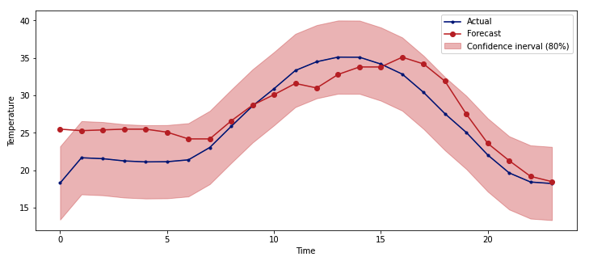

# Air-temperature model for Greenhouse climate

# Prediction task: 

Predict the GreenHouse air temperature up to 24 hours in advance with 1 hour timesteps.

# Dataset

We chose the GreenHouseClimate dataset from **Automatoes team** and combined with the Weather dataset to build our prediction model. 

For more details on our findings, please refer to: `notebooks/experimental_notebook.ipynb`

# Choice of Model:

We did a thorough experimentation on a variety of models (statistical, Machine learning and Neural Nets) for this task and we narrowed our choice to XGBoost due to its performance against our dataset. The **XGBoost** had the highest accuracy of 88%. 

For more details on our findings, please refer to `notebooks/experimental_notebook.ipynb`

# Results:
We make a prediction with 88% accuracy at \[P10,P90\] on Air temperature for the last 24 hours in our dataset. 



# Instructions on how to use our model, train and make predictions out of it :

- ## Installation:

    `$ pip install -i https://test.pypi.org/simple ghlearn`
    
    NOTE: Please also install the dependencies. You could also install them from the  `requirements.txt` file on this repository.

-  ## Train on a new dataset. 
    
    From your python prompt run:

    ```shell
        >> from ghlearn.preprocessing import load_data, preprocess, transform
        >> from ghlearn.model_selection import train_test_split
        >> from ghlearn.model import GreenHousePredictor

        >> weather_df = load_data(path_to_weather_file)
        >> ghclimate_df = load_data(path_to_ghclimate_file)

        >> weather_df = preprocess(weather_df)
        >> ghclimate_df = preprocess(ghclimate_df)
        >> final_df = transform(weather_df, ghclimate_df)

        >> X_train, Y_train, X_test, Y_test = train_test_split(final_df, predict_on='Tair')
        >> model = GreenHousePredictor()
        >> model.train(X_train, Y_train
    ```

- ## Test on a new dataset
    ```shell
        >> from ghlearn.preprocessing import load_data, preprocess
        >> from ghlearn.model import GreenHousePredictor
        >> from ghlearn.plot import forecast_plot

        >> model = GreenHousePredictor()

        >> weather_df = load_data(path_to_weather_file)
        >> weather_df = preprocess(weather_df)

        >> y_pred = model.predict(weather_df)
        >> forecast_plot(path_to_file_to_save_the_image)
    ```

NOTE: This package will only work with files which have the same format as the example files provided for this task. 